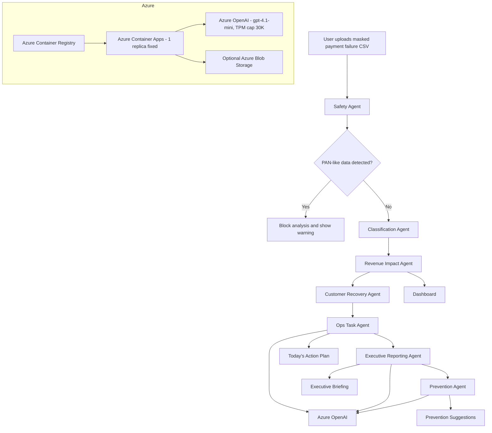

# Payment Intelligence Agent

**AI Revenue Ops Desk for subscription payment failures.**
Microsoft Agent Hackathon 2026 prototype.

> Payment Intelligence Agentは、サブスクリプション事業における決済エラー対応を、
> AIエージェントによるRevenue Operations業務に変えるプロトタイプです。

| | |
| --- | --- |
| **What it does** | Masked CSV → 7-agent workflow → prioritized action plan, executive briefing, customer-support drafts, prevention proposals. |
| **What it does NOT do** | Process payments. Execute retries. Send customer emails. Touch the payment critical path. Guarantee revenue recovery. Use real card data. |
| **Stack** | Next.js 14 (App Router, TypeScript) · Tailwind CSS · Azure OpenAI (`gpt-4.1-mini`, with deterministic mock fallback) · **Azure Container Apps** + Azure Container Registry |
| **Live URL** | `https://pia-demo-51ff8c.bluebush-37a0c845.japaneast.azurecontainerapps.io` |

---

## 1. Problem

サブスクリプション事業者の決済エラー対応は、現場で以下のように分断されがちです:

- PSP管理画面で個別エラーを確認する
- CSVを抽出して表計算で集計する
- 顧客対応はCSが個別判断する
- 経営報告は別途まとめ直す

この**断片化**こそが、Revenue Leakageの最大要因の一つです。
Payment Intelligence Agentは、マスク済みCSVを起点に、
**安全確認 → 分類 → 売上影響 → 顧客対応 → 経営報告 → 再発防止**までを
AIエージェントが一気通貫で整理します。

## 2. Agent Workflow

| # | Agent | Role | AI? |
| --- | --- | --- | --- |
| 1 | **Safety Agent** | PANらしき値・必須カラムを検出。問題があれば分析を停止。 | rule-based |
| 2 | **Classification Agent** | エラーコードをリトライ候補 / 顧客対応 / リトライ非推奨 / 要確認の4カテゴリに分類。 | rule-based |
| 3 | **Revenue Impact Agent** | カテゴリ別・コード別の売上影響と対応余地を集計。 | rule-based |
| 4 | **Customer Recovery Agent** | 顧客対応候補と用途別の下書きメッセージを生成。 | Azure OpenAI / mock |
| 5 | **Ops Task Agent** | 担当者向けの優先タスク（High / Medium / Low）を作成。 | rule-based |
| 6 | **Executive Reporting Agent** | 経営者向け1ページMarkdownブリーフィングを生成。 | Azure OpenAI / mock |
| 7 | **Prevention Agent** | 次月以降の運用改善提案を生成。 | Azure OpenAI / mock |

設計原則は **Rule-first, AI-assisted**:
分類・売上影響・リスク判定は決定的ルールで処理し、AIは経営者向けの文言・下書き・推奨表現の生成のみに使われます。
**AIはルールベース分類を上書きしません。**

## 3. Architecture



詳細は [docs/architecture.md](docs/architecture.md) を参照してください。

## 4. Tech Stack

- **Frontend:** Next.js 14 (App Router, `output: "standalone"`), React 18, TypeScript, Tailwind CSS
- **Fonts:** Inter + Noto Sans JP (via `next/font/google`)
- **Backend:** Next.js API routes (Node.js runtime)
- **AI:** Azure OpenAI Chat Completions (`gpt-4.1-mini`, TPM 30K cap for cost protection)
- **Hosting:** **Azure Container Apps** (Linux, single container, min=max=1 replica for cost predictability)
- **Container Registry:** Azure Container Registry (Basic SKU, cloud build via ACR Tasks — no local Docker required)
- **Storage:** In-memory analysis store (per process lifetime, `globalThis`-bound to survive Next.js module boundaries). Azure Blob Storage is optional and not required for the demo.

## 5. Run locally

```bash
npm install
npm run dev
```

Open <http://localhost:3000> (Next.js may fall back to a free port if 3000 is taken).

### Demo path (no setup required)

1. From the landing page, click **「サンプルCSVでデモを開始」**.
2. The upload page shows the bundled sample CSV (80 rows, no PII).
3. Click **「分析を開始」** to run the 7-agent pipeline.
4. The Agent Timeline animates each agent in turn.
5. Auto-advance to the Dashboard, then explore Action Plan, Executive Briefing, Scenario Simulator, Drafts, and Prevention.

The demo works with **no Azure OpenAI credentials** — the app falls back to deterministic mock responses.

## 6. Environment variables

Create a `.env.local` file locally, or set these on Container Apps (`az containerapp update --set-env-vars ...`):

```env
AZURE_OPENAI_ENDPOINT=https://<your-resource>.openai.azure.com
AZURE_OPENAI_API_KEY=<key>
AZURE_OPENAI_DEPLOYMENT=<your-chat-deployment-name>   # NOT model name — deployment name
AZURE_OPENAI_API_VERSION=2024-08-01-preview
```

**All four must be set** for live Azure OpenAI to engage. If any is missing — or any call fails (including 429 rate-limit) — the app silently falls back to mocks, and the UI labels the AI mode as `mock` per agent so the operator can see exactly what happened. On Container Apps, the API key should be stored as a Container App **secret** and referenced via `secretref:`. See [docs/deploy-container-apps.md §7](docs/deploy-container-apps.md) for the exact commands.

## 7. Azure Container Apps deployment

**現行デプロイ先**: Azure Container Apps (`japaneast`) + Azure Container Registry。

> 当初 App Service を予定していましたが、Free Trial アップグレード後の PAYG サブスクリプションで VM クォータがゼロに固定されていたため、別クォータ系統を持つ **Container Apps に pivot** しました。詳細は [CHANGELOG.md](CHANGELOG.md) v0.3.0 を参照。

### 7.1 構成

| 項目 | 値 |
| --- | --- |
| Resource Group | `pia-rg` (`japaneast`) |
| Container Apps Environment | `pia-env` |
| Container App | `pia-demo-<6char>` (min=max=1 replica, 0.5 vCPU / 1 GiB) |
| Container Registry | `piaacr<6char>.azurecr.io` (Basic SKU) |
| Image | `pia-app:vN` (Next.js standalone, multi-stage Alpine, 非root実行) |
| Azure OpenAI | `pia-aoai-<6char>` (`eastus`, S0 SKU) |
| AOAI Deployment | `gpt-4.1-mini` v `2025-04-14`, Standard SKU, TPM cap **30** |

### 7.2 What this app needs at runtime

| Requirement | How it's satisfied |
| --- | --- |
| Node 20+ | Dockerfile uses `node:20-alpine` (multi-stage) |
| Listen on `0.0.0.0:3000` | Dockerfile sets `ENV PORT=3000 HOSTNAME=0.0.0.0`; Next.js standalone server respects these |
| Build step | Done at Docker build time (`npm run build`); ACR Tasks builds in the cloud — **no local Docker required** |
| Start command | `node server.js` (Next.js standalone output) |
| Secrets | API key stored as Container App **secret**, referenced via `secretref:aoai-key` (not plain env var) |

### 7.3 Quick deploy

詳細手順は [docs/deploy-container-apps.md](docs/deploy-container-apps.md) を参照(コマンド単位 11 セクション)。要点だけ:

```bash
# 1. Cloud build (no local Docker needed)
az acr build --registry "$PIA_ACR" --image "pia-app:v1" --file Dockerfile .

# 2. Container App from that image
az containerapp create --name "$PIA_APP" --resource-group "$PIA_RG" \
  --environment "$PIA_ENV" --image "$PIA_ACR.azurecr.io/pia-app:v1" \
  --target-port 3000 --ingress external \
  --registry-server "$PIA_ACR.azurecr.io" \
  --registry-username "$ACR_USER" --registry-password "$ACR_PASS" \
  --cpu 0.5 --memory 1.0Gi --min-replicas 1 --max-replicas 1

# 3. Wire Azure OpenAI (secret + env vars)
az containerapp secret set --name "$PIA_APP" --resource-group "$PIA_RG" \
  --secrets "aoai-key=$AOAI_KEY"
az containerapp update --name "$PIA_APP" --resource-group "$PIA_RG" \
  --set-env-vars \
    "AZURE_OPENAI_ENDPOINT=$AOAI_ENDPOINT" \
    "AZURE_OPENAI_DEPLOYMENT=$AOAI_DEPLOYMENT_NAME" \
    "AZURE_OPENAI_API_VERSION=2024-08-01-preview" \
    "AZURE_OPENAI_API_KEY=secretref:aoai-key"
```

### 7.4 Verifying the deployment

1. Open `https://<fqdn>` (Container App の `properties.configuration.ingress.fqdn`)
2. Click **「▶ サンプルCSVで30秒デモを開始」** → 分析を開始
3. Agent Timeline で各エージェントのバッジを確認:
   - `Azure OpenAI` バッジ(金色) → ライブ呼び出し成功(Customer Recovery / Executive Reporting / Prevention の3エージェント)
   - `rule-based` バッジ(緑色) → 決定的処理(Safety / Classification / Revenue Impact / Ops Task)
4. すべて 7/7 完了したら Dashboard → Action Plan → Briefing → Scenario → Drafts → Prevention を回遊

### 7.5 Operational notes

- **No outbound calls** beyond Azure OpenAI. No PSP API integration in the prototype.
- **In-memory analysis store** (single-instance, `globalThis`-bound). To scale horizontally, replace `src/lib/store.ts` with Azure Cache for Redis or a Cosmos DB collection — the contract is intentionally tiny.
- **TPM 30K cap on Azure OpenAI**: 429 (rate limit) 発生時は自動で mock fallback。コスト暴走しない構造的保護
- **min=max=1 replica fixed**: オートスケール無効化でコスト固定化。月 ¥4,000〜¥5,800 程度(Free Trial $200 クレジット内)
- **Re-deploy**: `az acr build ... v2` → `az containerapp update --image ... v2` の 2 ステップ

## 8. Safety and privacy design

- **No payment processing.** This app analyzes a CSV. It cannot initiate retries, send emails, or call any PSP API.
- **No real card data.** A Luhn check on cell contents blocks analysis whenever a PAN-shaped value (13–19 digits, Luhn-valid) is detected.
- **Masked CSV only.** The bundled sample contains zero PII, no real customer identifiers, no phone numbers, no emails, no PAN.
- **AI inputs are aggregates.** The Azure OpenAI client never sends raw rows. Only category counts, top error codes, and revenue aggregates flow to the model.
- **Tone discipline.** The system prompt forbids claims of automatic recovery, retry execution, or learning. AI text uses cautious language (「可能性があります」「候補として管理できます」).

詳細は [docs/architecture.md](docs/architecture.md#safety) を参照。

## 9. Demo script

[3-minute demo script (Japanese)](docs/demo-script-3min.md)

## 10. Repository layout

```
.
├── README.md                              プロジェクト概要(このファイル)
├── CHANGELOG.md                           変更履歴(v0.1.0 → 現在)
├── Dockerfile                             Next.js standalone, multi-stage Alpine, 非root実行
├── .dockerignore                          ビルドコンテキスト除外
├── .env.example                           環境変数テンプレ
├── .eslintrc.json / .gitignore
├── next.config.mjs                        output: "standalone" 設定
├── package.json                           scripts: dev/build/start/lint/check:forbidden/sample:generate
├── postcss.config.js
├── tailwind.config.ts                     AI Orchestra ブランドカラー(forest green + champagne gold)
├── tsconfig.json
│
├── src/
│   ├── app/
│   │   ├── layout.tsx                     Inter + Noto Sans JP, SiteHeader
│   │   ├── globals.css                    CSS変数 + Tailwind components (card / btn / badge)
│   │   ├── page.tsx                       Landing
│   │   ├── upload/                        Upload + sample loader (Step 1)
│   │   ├── analyze/[id]/
│   │   │   ├── page.tsx                   redirect → /dashboard
│   │   │   ├── timeline/                  Agent Timeline (Step 2, animated)
│   │   │   ├── dashboard/                 Dashboard (KPI/charts/table)
│   │   │   ├── action-plan/               Today's Action Plan (High/Med/Low)
│   │   │   ├── briefing/                  Executive Briefing (Markdown + copy)
│   │   │   ├── scenario/                  Scenario Simulator (3-way switch)
│   │   │   ├── drafts/                    Customer Support Drafts
│   │   │   └── prevention/                Prevention Suggestions
│   │   └── api/
│   │       ├── analyze/                   POST /api/analyze
│   │       ├── analysis/[id]/             GET  /api/analysis/[id]?scenario=...
│   │       └── sample/                    GET  /api/sample[?download=1]
│   ├── components/                        Shared UI
│   │   ├── site-header.tsx
│   │   ├── analysis-header.tsx
│   │   ├── analysis-tabs.tsx
│   │   └── scenario-switcher.tsx
│   └── lib/
│       ├── types.ts                       Shared types
│       ├── classification.ts              Rule-based error categorization
│       ├── csv.ts                         Parse + Luhn-based PAN detection
│       ├── aggregate.ts                   Revenue + action item aggregation
│       ├── scenario.ts                    Scenario reordering
│       ├── ai.ts                          Azure OpenAI client + mock fallback
│       ├── pipeline.ts                    7-agent orchestration
│       └── store.ts                       In-memory analysis store (globalThis-bound)
│
├── sample/
│   └── payment_failures_sample.csv        80 synthetic rows
├── public/                                Next.js static assets (空 placeholder)
├── scripts/
│   ├── generate-sample.mjs                Deterministic CSV generator
│   └── check-forbidden-terms.mjs          CI 用 forbidden term scanner
└── docs/
    ├── architecture.md                    システム設計詳細
    ├── prompts.md                         AI プロンプト設計
    ├── deploy-container-apps.md           Azure デプロイ手順(11セクション)
    ├── demo-script-3min.md                3分動画ナレーション台本
    ├── demo-recording-operator-script.md  3分動画オペレーター用カット表
    ├── zenn-article-draft.md              Zenn 記事下書き
    ├── zenn-publish-checklist.md          公開前TODOチェックリスト
    ├── submission-checklist.md            提出前一般チェック
    └── submission-form-draft.md           提出フォーム転記用ドラフト
```

各ファイルは「何のためにあるか」が一目で分かるよう一行コメント付き。提出までに使わないファイル・重複ファイルは含めていません。

## 11. License & attribution

Prototype submitted to **Microsoft Agent Hackathon 2026**. No proprietary code or customer data is included.

ブランドカラー・フォント(`#1a4731` フォレストグリーン / `#c9a84c` シャンパンゴールド / Inter / Noto Sans JP)は **視覚的な調和のため** AI Orchestra デザインを参考にしていますが、ロゴ・名称・プロプライエタリコードは **一切使用していません**。
