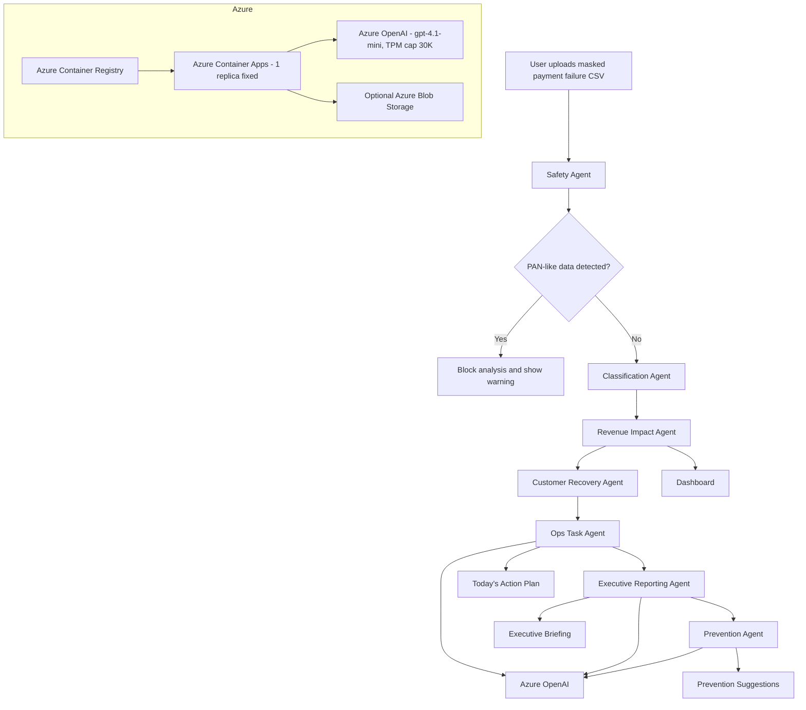

# Architecture

## 1. Overview

Payment Intelligence Agent is a Next.js 14 application deployed on **Azure Container Apps** (single container, min=max=1 replica). A single Node.js process serves both the React UI (App Router) and the API routes that orchestrate the 7-agent pipeline. The only external dependency is Azure OpenAI Chat Completions (`gpt-4.1-mini`); if it's unavailable or rate-limited (429), the system degrades to deterministic mock responses per AI agent without breaking the user flow.

> 当初 App Service を予定していましたが、Free Trial / PAYG 新規サブスクリプションの VM クォータが 0 で固定されていたため Container Apps に pivot。詳細は [../CHANGELOG.md](../CHANGELOG.md) v0.3.0。



## 2. Components

### 2.1 Pipeline (`src/lib/pipeline.ts`)

Single function `runAnalysis(csvText, { scenario })` executes the 7 agents sequentially. Each agent step is timed and produces an `AgentRun` record with status, message, duration, and `used_ai` flag — these populate the Agent Timeline UI.

Order matters:
1. **Safety** runs first and is allowed to abort the entire run.
2. **Classification → Revenue Impact** are deterministic and cheap.
3. **Customer Recovery / Executive Reporting / Prevention** may invoke Azure OpenAI; failures are caught and the agent falls back to mocks without disrupting downstream agents.

### 2.2 Classification (`src/lib/classification.ts`)

A static `Record<error_code, Classification>` is the source of truth. The rule for safe-retry candidates degrades to `manual_review` when `attempt_count > 2` or the subscription is not `active` / `past_due`. This keeps the system predictable and auditable.

### 2.3 PAN detection (`src/lib/csv.ts`)

Each cell is scanned for digit runs of 13–19. Matches are validated with the Luhn algorithm. **A single Luhn-valid hit anywhere in the file blocks the analysis.** We never store or echo the matched value back to the client — only the fact a match occurred.

### 2.4 AI client (`src/lib/ai.ts`)

Three modes:

- **Briefing:** sends aggregates only; AI returns Markdown body; the structured fields (totals, risks) come from deterministic data.
- **Drafts:** AI optionally refines the wording of 4 pre-blessed Japanese templates; the structure (subject/body/category/affected_count) stays deterministic.
- **Prevention:** AI proposes 1–5 suggestions; output is validated against a strict shape; invalid responses fall back to the curated mock list.

Mock responses are not stubs — they're the canonical templates the AI is asked to reproduce. This means the demo looks identical to the AI-powered output, with the AI adding tone refinements rather than inventing content.

### 2.5 Scenario simulator (`src/lib/scenario.ts`)

A pure function `reorderActions(items, scenario)` re-sorts action items according to one of three priorities. It does NOT regenerate AI content and does NOT trigger any payment action. The simulator's purpose is to compare prioritization views, not to commit to a strategy.

### 2.6 Storage

In-memory `Map<id, AnalysisResult>` keyed by short ID. Capped at 50 entries with LRU eviction. The map is attached to `globalThis` so it survives across Next.js module-bundle boundaries (necessary for dev mode and certain HMR scenarios). Sufficient for a single-instance demo. For multi-replica Container Apps scaling, this would be replaced by Azure Cache for Redis or a small Cosmos DB collection — the contract (`putAnalysis` / `getAnalysis`) is intentionally tiny.

## 3. Data flow

```
[Browser] --POST /api/analyze (CSV) --> [Next.js API route]
                                            |
                                            v
                                       runAnalysis() — 7 agents
                                            |
                              +-------------+-------------+
                              |                           |
                              v                           v
                        Azure OpenAI               Deterministic rules
                       (briefing/drafts/             (safety/classify/
                        prevention)                   revenue/ops)
                              |                           |
                              +-------------+-------------+
                                            |
                                            v
                                       AnalysisResult
                                            |
                                            v
                                      In-memory store
                                            |
[Browser] <--JSON { id, result } -- [API route]
        |
        +-> redirect to /analyze/[id]/timeline (animates agent_runs)
        +-> /analyze/[id]/dashboard, action-plan, briefing, scenario, drafts, prevention
```

## 4. Azure setup

- **Container Apps (Linux):** runs `node server.js` (Next.js standalone) inside `node:20-alpine`. min=max=1 replica で固定費化。
- **Container Registry (Basic):** Docker イメージ保管。ACR Tasks でクラウドビルド(ローカル Docker 不要)。
- **Azure OpenAI resource:** `gpt-4.1-mini` (v 2025-04-14) を Standard SKU、TPM cap **30** で配置。429 になったら mock fallback。
- **Container App Configuration:** `AZURE_OPENAI_*` 4変数。API key は **Container App secret** として保存、env var は `secretref:` 参照。
- **Optional Blob Storage:** if you want to archive `AnalysisResult` JSON for historical review — not required for the demo.

詳細手順: [deploy-container-apps.md](deploy-container-apps.md)

## 5. Safety design {#safety}

| Concern | Mitigation |
| --- | --- |
| Real card numbers in uploaded CSV | Luhn-validated digit-run scan blocks analysis. |
| AI overriding rule-based classification | AI is only invoked for narrative outputs (briefing, drafts, prevention); the structured classifications come from deterministic code. |
| AI inventing claims of automatic recovery | System prompt explicitly forbids those terms; mock fallback uses pre-blessed wording. |
| Large CSV / DoS | 2MB upload cap on the API route. |
| Multi-tenant data leakage | Single-process in-memory store; no persistent identifiers tied to users. For production, swap with per-tenant Redis. |
| Re-sending stale customer messages | Drafts are read-only Japanese text shown in the browser; no send button anywhere in the app. |

## 6. Forbidden terms

The system prompt (and the codebase reviewer) avoids these terms:

`自動再請求`, `完全自動回収`, `回収保証`, `AIが学習`, `機械学習モデル`, `高度なAIリトライ`, `AIが最適なリトライを判断`, `AIが売上を自動回収`, `Visa`, `Cybersource`, `RecoverAI`.

Preferred terms include `AIエージェント`, `AI Revenue Ops Desk`, `AIアクション提案`, `経営者向けブリーフィング`, `安全に確認できる取引`, `リトライを避けるべき取引`, `Revenue Operations支援`, `Payment Intelligence Agent`.

## 7. Future work (not in MVP)

- Persistent analysis history (Azure Blob / Cosmos DB)
- Multi-tenant auth (Microsoft Entra)
- PSP read-only adapters for live ingestion (no writes)
- Per-customer retry policy rules
- Webhook out to Notion / Slack for the Executive Briefing
