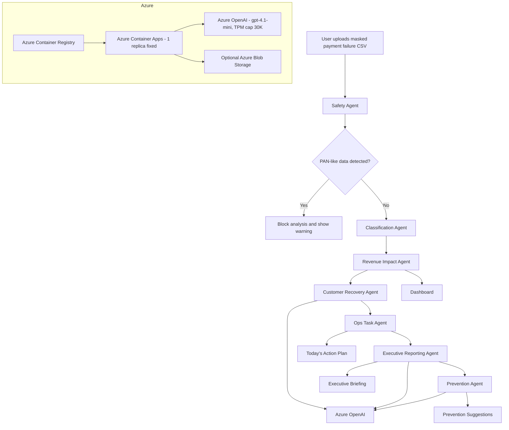

# 提出フォーム下書き — Microsoft Agent Hackathon 2026

提出フォームの正確なフィールドが手元にないため、**よくあるハッカソンの応募項目** を網羅的に用意しました。
フォームに該当項目がない場合はスキップしてください。各ブロックはそのままコピペ可能です。

> **重要**: 公開アプリURL / 動画URL / Zenn記事URL は提出前に必ず実値に置き換えてください。
> プレースホルダ箇所はすべて `<...>` で囲ってあります。

---

## A. プロジェクト基本情報

### A-1 プロジェクト名(日本語)

```
Payment Intelligence Agent
```

### A-2 プロジェクト名(英語)

```
Payment Intelligence Agent
```

### A-3 サブタイトル / キャッチコピー(日本語・1行)

```
決済エラー対応を、AI Revenue Ops Deskに。
```

### A-4 タグライン(英語・1行・~80字)

```
An AI Revenue Operations Desk for subscription payment failures — Rule-first, AI-assisted.
```

### A-5 カテゴリ(該当しそうなもの)

- AIエージェント
- 業務効率化 / Revenue Operations
- Azure OpenAI 活用
- Multi-agent workflow

---

## B. 説明文(長さ別)

文字数制限のあるフィールド向けに 3 段階で用意。

### B-1 100 字以内(短い説明)

```
マスク済み決済エラーCSVを起点に、7つのAIエージェントが安全確認・分類・売上影響・顧客対応・経営報告・再発防止までを1ワークフローで整理するRevenue Ops Desk。
```

(94 字)

### B-2 300 字以内(中)

```
Payment Intelligence Agentは、サブスクリプション事業者の決済エラー対応を「AI Revenue Operations業務」として再設計するプロトタイプです。マスク済みCSVを入力すると、7つのAIエージェントが順に処理を進め、安全確認・エラー分類・売上影響・優先タスク・経営者向けブリーフィング・顧客対応下書き・再発防止提案までを1つのワークフローで整理します。Rule-first, AI-assistedの設計で、分類や売上計算は決定的ルール、Azure OpenAIは文章生成のみに使用。決済処理・リトライ実行・顧客への自動送信は行いません。
```

(279 字)

### B-3 600 字以内(長)

```
サブスクリプション事業者の決済エラー対応は、PSP管理画面・CSV・顧客対応・経営報告に分断されがちです。この「断片化」が売上の取りこぼし(Revenue Leakage)の大きな要因の一つだと考え、Payment Intelligence Agentを設計しました。

マスク済みのエラーCSVをアップロードすると、Safety / Classification / Revenue Impact / Customer Recovery / Ops Task / Executive Reporting / Prevention の7つのAIエージェントが順に処理を進め、以下を1つのワークフローで生成します:ダッシュボード、Today's Action Plan、経営者向けMarkdownブリーフィング、Scenario Simulator(顧客体験/売上回収/リスク最小化)、顧客対応下書き、再発防止提案。

設計原則は「Rule-first, AI-assisted」。安全確認・エラー分類・売上影響・優先度判定はすべて決定的ルールで処理し、Azure OpenAIは経営者向け文章・推奨表現・下書き生成のみに使用します。AIはルールベース分類を上書きしません。

Azure Container Apps上で動作し、Azure OpenAI環境変数が未設定でもmock応答にフォールバックするため、デモは必ず動作します。TPM上限とmock fallbackの二重保護でコスト暴走も構造的に防いでいます。本ツールは決済処理・リトライ実行・顧客への自動送信を一切行いません。
```

(572 字)

---

## C. 課題と解決

### C-1 解決したい課題(Problem)

```
サブスクリプション事業者の決済エラー対応は、PSP管理画面、CSV抽出、表計算での集計、CSによる個別判断、経営報告の取りまとめ等、複数のツールと担当者にまたがって分断されています。この断片化により、対応の優先順位付けが属人化し、売上の取りこぼしの全体像が経営に届かず、再発防止まで踏み込めない状態が続いています。
```

### C-2 提供する解決策(Solution)

```
マスク済み決済エラーCSVを起点とした7-Agent Workflowで、安全確認 → 分類 → 売上影響 → 顧客対応 → 優先タスク → 経営報告 → 再発防止までを1つのワークフローに統合します。分類・売上計算は決定的ルール、文章生成のみAzure OpenAIに任せる「Rule-first, AI-assisted」設計により、ハルシネーションを構造的に抑えながら、経営者向けの自然言語サマリーまでを自動生成します。
```

### C-3 ターゲットユーザー

```
SaaS / D2C / メディアなど、月次/年次サブスクリプションの決済を運用する事業のRevenue Operations、Customer Success、Financeチーム。
```

---

## D. 技術スタック

### D-1 Azure サービス

- **Azure Container Apps** (Linux, japaneast, 1 replica fixed) — Webホスティング
- **Azure Container Registry** (Basic SKU) — Dockerイメージ保管 + ACR Tasks によるクラウドビルド(ローカル Docker 不要)
- **Azure OpenAI** (`gpt-4.1-mini` v 2025-04-14, Standard SKU, TPM cap 30K) — 経営者向けブリーフィング・下書き生成・再発防止提案
- **Container Apps Environment + Log Analytics** — 実行環境とログ収集

オプション(本MVPでは未使用):

- Azure Blob Storage(分析結果の永続化)
- Azure Cache for Redis(マルチインスタンス化時のセッションストア)
- Microsoft Entra(マルチテナント認証)

> 当初は App Service を予定していましたが、Free Trial アップグレード後の VM クォータ仕様により Container Apps へ pivot。詳細は CHANGELOG.md v0.3.0。

### D-2 アプリケーションスタック

- **Frontend**: Next.js 14 (App Router) / React 18 / TypeScript / Tailwind CSS
- **Backend**: Next.js API Routes (Node.js runtime)
- **CSV**: papaparse (クライアント・サーバー両用)
- **AI client**: 素のfetch(SDKなし、依存最小化)
- **Storage**: In-memory Map(`globalThis` 経由でモジュール間共有)

### D-3 設計原則

```
Rule-first, AI-assisted
- 分類・売上影響・優先度判定は決定的ルール
- Azure OpenAIは経営者向け文章・推奨表現・下書き生成のみ
- AIはルールベース分類を上書きしない
- AIへの送信は集計データのみ(行レベルの個人識別子は送らない)
- 環境変数未設定・呼び出し失敗時はmock応答にフォールバック
```

---

## E. URL 群(提出フォームに転記する欄)

> **すべて事前に実URLへ置き換え必須**

### E-1 公開アプリURL(必須)

```
https://pia-demo-51ff8c.bluebush-37a0c845.japaneast.azurecontainerapps.io
```

(Azure Container Apps の FQDN。`<app-name>.<env-id>.<region>.azurecontainerapps.io` 形式)

### E-2 Zenn 記事URL(必須)

```
https://zenn.dev/<your-handle>/articles/<slug>
```

### E-3 3分デモ動画URL(YouTube、必須)

```
https://youtu.be/<video-id>
```

### E-4 GitHub リポジトリURL(任意・推奨)

```
https://github.com/<your-handle>/payment-intelligence-agent
```

### E-5 デモ認証情報

```
不要(認証なし)。サンプルCSVが同梱されており、ランディングページの
「サンプルCSVで30秒デモを開始」ボタンから誰でも全機能を試せます。
```

---

## F. アーキテクチャ図(Mermaid)

フォームが画像アップロード形式なら、以下を画像化して貼り付け(`docs/architecture.md` 内の図と同一):



> Mermaid を画像化するには <https://mermaid.live> で SVG/PNG エクスポートが手早い。

---

## G. 安全性・コンプライアンス(差別化ポイント)

```
- 決済処理を一切行いません(PSP APIへの接続なし)
- リトライ実行を行いません
- 顧客への自動送信を行いません(下書きはブラウザに表示するのみ)
- マスク済みCSV前提。PANらしき値(13-19桁・Luhnチェック合格)を検出したら分析を停止
- Azure OpenAIへは集計データのみ送信。顧客ID・取引ID・タイムスタンプは送らない
- AI出力には「mock応答」「Azure OpenAI応答」を区別するバッジを常時表示し、ユーザーが透明性を確保
- 禁止語(自動再請求・回収保証など)をSystem Promptで明示禁止 + CI(npm run check:forbidden)で混入防止
- 認証なし・個人情報なし・本番データなしで動作するハッカソン専用プロトタイプ
```

---

## H. ハッカソン要件チェック

| 項目 | 状態 |
| --- | --- |
| 既存の社内コード・proprietary code を含まない | ✓ 全て新規実装 |
| 実在の顧客・決済データを含まない | ✓ サンプル80件はすべて合成データ |
| Microsoft Agent Hackathon 2026 のために新規作成 | ✓ |
| 応募期間中アプリが起動している(2026-06-18 まで) | ✓ 予定(Always On 設定) |
| 動画は3分以内 | ✓ |
| Zenn記事に動画埋め込み + アーキテクチャ図 | ✓ |

---

## I. チーム / 連絡先(個人応募の場合は適宜)

### I-1 代表者

```
氏名: <提出者氏名>
連絡先: <提出者メール>
所属: <所属(任意)>
```

### I-2 チームメンバー

```
個人応募(1名)
```

または

```
- <氏名 1>(役割)
- <氏名 2>(役割)
```

---

## J. 自由記述欄(あれば)

### J-1 工夫した点(300字)

```
「AIに何でもやらせる」のではなく、「AIに自然言語の仕事だけ任せる」設計を徹底しました。分類・売上計算は決定的ルール、AIは経営者向け文章・下書き・再発防止文の生成のみ。経営ブリーフィングの数字フィールドは決定的データから埋め、AIには本文Markdownだけを書かせることで、構造的にhallucinationを抑制しています。また、Azure OpenAI未設定時はmock応答にフォールバックし、デモが必ず動作する設計にしました。
```

(202 字)

### J-2 今後の展望(200字)

```
マルチテナント認証(Microsoft Entra)、永続ストレージ(Azure Blob / Cosmos DB)、PSPからの読み取り専用アダプター、Semantic Kernel化を計画しています。一方で「決済処理・リトライ実行・顧客への自動送信は行わない」という安全方針は維持し、ヒトの判断を中心に据えたRevenue Ops支援ツールとして磨いていきます。
```

(170 字)

---

## K. 提出直前の最終チェック

提出ボタンを押す **前** に:

- [ ] 公開アプリURL → ブラウザで開いて 200 確認
- [ ] Zenn記事URL → シークレットウィンドウで開ける
- [ ] YouTube動画URL → シークレットウィンドウで再生できる
- [ ] GitHubリポジトリ → 未ログインで閲覧可能
- [ ] 上記4 URL の **typo** がない(コピペミス確認)
- [ ] フォーム送信前に **下書き保存**(可能なら)
- [ ] フォーム送信後の確認メールが届く(届かなければ再送信を検討)

---

## L. このファイルの使い方

1. フォームを開いた状態で、このファイルを横に並べる
2. フィールド名で `Cmd+F` してこのファイル内を検索
3. 該当ブロックをコピー
4. URL系の箇所だけ実値に置き換えて貼り付け
5. すべて埋まったら §K の最終チェックを実施

> 不明な項目はそのままにせず、運営に問い合わせる or 「該当なし」と明記してください。
