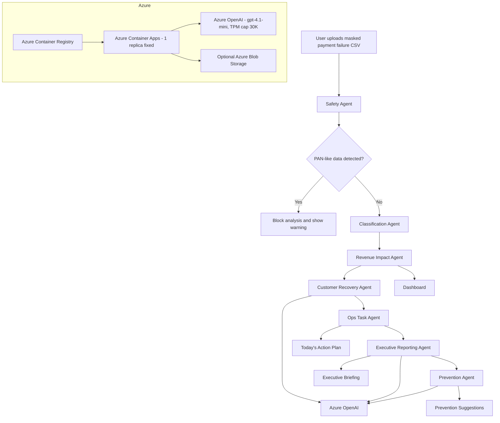

> **副題:** ルールで安全に分類し、AIエージェントが次アクションまで整理する Payment Intelligence Agent
>
> Microsoft Agent Hackathon 2026 応募作品

<!-- 公開前TODO: YouTube 動画ID 確定 → VIDEO_ID_PLACEHOLDER を全置換 → frontmatter の published を true に -->
<!-- アプリURL/GitHub URL は埋め込み済み -->


## TL;DR

- **問題:** サブスク事業者の決済エラー対応は、PSP管理画面・CSV・顧客対応・経営報告に分断されている
- **作ったもの:** マスク済みCSVを入力すると、7つのAIエージェントが「安全確認 → 分類 → 売上影響 → 顧客対応 → 経営報告 → 再発防止」を1ワークフローで整理する Web アプリ
- **設計:** **Rule-first, AI-assisted** — 分類・売上計算・優先度はルール、AIは経営者向け文章・下書き・推奨表現の生成のみ
- **構成:** Next.js 14 + TypeScript + Tailwind を **Azure Container Apps** にデプロイし、Azure OpenAI (`gpt-4.1-mini`) を呼び出し
- **安全:** 決済処理・リトライ・顧客送信は **行わない**。AIへの送信は集計済みデータのみ。PANらしき値を検出したら分析停止
- **デモ:** Azure OpenAI 環境変数がなければ mock 応答にフォールバックし、デモが必ず動作

> ⚠️ 本ツールは決済処理・リトライ実行・顧客への自動送信を行いません。マスク済みCSVを分析し、推奨と下書きを生成するのみのプロトタイプです。

## 1. はじめに

サブスクリプション事業者にとって、決済エラーへの対応は地味で、しかし極めて重要な仕事です。
PSPの管理画面を開き、CSVを抜き出し、表計算ソフトで集計し、顧客対応をCSが個別判断し、経営報告は別途まとめ直す——
こうした**断片化**こそが、Revenue Leakage(売上の取りこぼし)の最大要因の一つだと考えています。

本稿では、Microsoft Agent Hackathon 2026 に応募したプロトタイプ
**Payment Intelligence Agent** について、設計の意図と実装の工夫を紹介します。

🔗 デモアプリ: https://pia-demo-51ff8c.bluebush-37a0c845.japaneast.azurecontainerapps.io
(Azure Container Apps の FQDN。固定で変わりません)

## 2. 解決したい課題

- **PSPと自社DBのステータス差分**を毎月確認するのが手作業
- **エラーコードごとの対応方針**が担当者の経験知に依存
- **顧客対応文面**が毎回スクラッチで書かれる
- **経営報告**で売上の取りこぼしの全体像が見えない
- **再発防止**まで踏み込めていない

これらを「1つのワークフロー」に統合できれば、Revenue Operationsとして再設計できるはず——という仮説です。

## 3. 作ったもの

<!-- 公開前TODO: YouTube 動画ID を貼り、この行と下の @[youtube] のIDを置換 -->

@[youtube](VIDEO_ID_PLACEHOLDER)

**主な画面:**

| 画面 | 目的 |
| --- | --- |
| Agent Timeline | 7エージェントの処理を可視化(アイコン + 所要時間 + AI利用バッジ) |
| ダッシュボード | KPI・カテゴリ別・エラーコード別の集計 |
| Today's Action Plan | 優先度別の担当者・推定金額付きタスクリスト |
| 経営ブリーフィング | Slack/Notionに貼れるMarkdownサマリー |
| Scenario Simulator | 顧客体験/売上回収/リスク最小化の3視点切替 |
| 顧客対応下書き | カード更新案内などの下書き(送信なし) |
| 再発防止 | 次月以降の運用改善提案 |

## 4. なぜ決済エラー対応にAI Agentが必要か

決済エラー対応は、「単純な集計」と「単純な顧客対応」の重ね合わせに見えて、実際は:

- 同じエラーコードでも、`attempt_count` や `subscription_status` によって取るべき行動が違う
- 顧客への文面は、エラーコード別にトーンも語彙も違う
- 経営報告は、いまの傾向と次の一手を **経営の語彙で** 説明する必要がある

——という、**ルール処理が必要な部分**と、**自然言語が必要な部分**が混じる仕事です。
ここに、**ルールベースの安全な分類**と、**AIによる自然言語生成**を組み合わせたエージェント設計が刺さると考えました。

## 5. Rule-first, AI-assisted の設計

本ツールの設計原則は **Rule-first, AI-assisted** です。

| 役割 | 担当 |
| --- | --- |
| 安全確認 (PAN検出/必須カラム) | 決定的ルール |
| エラーコード分類 | 決定的ルール |
| 売上影響計算 | 決定的ルール |
| 優先度判定 | 決定的ルール |
| 経営者向けブリーフィング文言 | Azure OpenAI |
| 顧客対応下書きのトーン調整 | Azure OpenAI |
| 再発防止提案の文章生成 | Azure OpenAI |

重要なのは、**AIはルールベース分類を上書きしない**こと。
AIが「リトライ非推奨」を「リトライ候補」と言い換えてしまうと、Revenue Operationsの安全性が崩れます。
分類・売上影響・リスク判定は決定的に処理し、AIは **文章を整えること** に専念させています。

UIにも `rule-based` / `Azure OpenAI` の色分けバッジを出して、ユーザーが「今見ているのがルール出力かAI出力か」を常に判別できるようにしています。

## 6. Multi-Agent Workflow

7つのエージェントを順に実行する素朴なオーケストレーションです。

```ts
// src/lib/pipeline.ts (抜粋)
export async function runAnalysis(csvText: string, options: RunOptions = {}) {
  // 1. Safety Agent           — PANらしき値・必須カラムを検出
  // 2. Classification Agent   — エラーコードを4カテゴリに分類
  // 3. Revenue Impact Agent   — 売上影響を集計
  // 4. Customer Recovery Agent — 顧客対応下書きを生成 (AI)
  // 5. Ops Task Agent         — 優先タスクを生成
  // 6. Executive Reporting Agent — 経営者向けブリーフィング (AI)
  // 7. Prevention Agent       — 再発防止提案 (AI)
}
```

各エージェントは `AgentRun` 型のレコードを返し、UIの Agent Timeline に表示されます。
所要時間・成功/失敗・AIを使ったかを、ユーザーが目で見て確認できる作りです。

```ts
interface AgentRun {
  agent: AgentName;
  label_ja: string;
  status: "ok" | "warning" | "blocked";
  message_ja: string;
  duration_ms: number;
  used_ai: boolean;        // ← AIを使ったかを明示
}
```

## 7. Azure構成



- **Azure Container Apps (Linux)** に Next.js standalone を 1 コンテナでデプロイ。min=max=1 replica 固定でコスト固定化
- **Azure Container Registry (Basic)** に ACR Tasks でクラウドビルド(**ローカル Docker 不要**)
- **Azure OpenAI** に `gpt-4.1-mini` deployment を Standard SKU、**TPM cap = 30K** で配置
- 環境変数 `AZURE_OPENAI_*` 4つを Container App に設定(API key は Container App **secret** として `secretref:` で参照)
- 環境変数が未設定 or 呼び出し失敗(429 含む)した場合は、**mock 応答にフォールバック** (デモが必ず動く)

> 当初は App Service を予定していましたが、Free Trial / 新規 PAYG サブスクリプションは VM クォータが 0 で固定されていたため、別クォータ系統の **Container Apps へ pivot** しました。pivot に必要だった実装変更は `output: "standalone"` の追加と Dockerfile の 3 ファイルのみ(機能コードは一切変更なし)。

### Azure OpenAI 呼び出し

シンプルな fetch ベースのクライアントです。SDK は使っていません(プロトタイプの依存を最小化するため)。

```ts
// src/lib/ai.ts (抜粋)
async function azureChat(messages: ChatMessage[], temperature = 0.3) {
  const url = `${endpoint}/openai/deployments/${deployment}/chat/completions`
            + `?api-version=${apiVersion}`;
  const res = await fetch(url, {
    method: "POST",
    headers: {
      "api-key": apiKey,
      "content-type": "application/json",
    },
    body: JSON.stringify({ messages, temperature, max_tokens: 1200 }),
  });
  // ...
}
```

## 8. プロンプト設計の工夫

詳細は `docs/prompts.md` に書いていますが、要点は3つです。

### (1) 生CSVは一切送らない

集計済みのカテゴリ件数、上位エラーコード、Revenue Impact、選択シナリオだけをAIに送ります。
顧客ID・取引ID・タイムスタンプ・エラーメッセージなどは送りません。

```ts
function summarizeForAi(result) {
  return {
    scenario: result.scenario,
    revenue: result.revenue,
    categoryBreakdown: result.categories.map(...),
    topErrorCodes: result.error_codes.slice(0, 8),
  };
}
```

### (2) 表現規約を System Prompt に書き切る

「自動再請求」「完全自動回収」「回収保証」「AIが学習」などの表現は **禁止**。
推測は「可能性があります」「候補として管理できます」「確認が必要です」「推奨されます」「担当者確認を前提とします」を優先するよう、System Prompt で指示しています。

### (3) 構造化フィールドはAIに任せない

経営ブリーフィングの **金額・件数の数字**は、AI 出力ではなく決定的ルールから埋めています。
AIが書くのは Markdown 本文だけ。**これにより数字の hallucination を構造的に防いでいます。**

同じ思想で、顧客対応下書きも `subject` と `body` のみ AI 上書きを許し、`category` / `applies_to_error_codes` / `affected_count` は決定的に決まります。

## 9. 実装上の工夫

ハッカソンプロトタイプとしての小ネタを5つ紹介します。

### (1) `globalThis` で in-memory ストアを共有

Next.js dev モードではルートバンドルが別モジュールインスタンスになるため、素朴な `Map` だとライターとリーダーで別ストアになってしまいました。`globalThis` にぶら下げて回避。

```ts
const g = globalThis as { __pia_analysis_store__?: Map<string, Entry> };
const map = g.__pia_analysis_store__ ?? (g.__pia_analysis_store__ = new Map());
```

### (2) AI 失敗時のフォールバックは「mock = 元テンプレ」

mock 応答はスタブではなく、AI に「これを参考に整えて」と渡している **元テンプレート** です。
だから AI が失敗してもデモ品質は変わらず、UI には `AI: mock` バッジで明示しています。

### (3) PAN 検出は Luhn まで

桁数(13–19)だけの判定だと false positive が多すぎるので、Luhn チェックを通したものだけブロック対象に。1セルでも検出したら全停止します。

### (4) 禁止語チェックを CI 化

`npm run check:forbidden` で `自動再請求` 等が UI / データに混入していないかをスキャン。System Prompt とドキュメントは allowlist。

### (5) Scenario Simulator は「並び替えと文言だけ」

シナリオ切り替えは action items の **再ソートと推奨文言の置き換え** だけ。決済処理やリトライ実行は一切走りません。これを UI と System Prompt の両方で明文化しています。

## 10. 安全性とプライバシー設計

- **PAN 検出**: 各セルを13–19桁の数値で走査し、Luhnチェックに合格したものを検出。1件でも見つかったら分析停止
- **マスク済みCSV前提**: サンプルCSVには実在しない `txn_*`, `cus_*` のみ。電話番号・メールアドレス・氏名は一切含まない
- **AI への送信は集計のみ**: 行レベルの個人識別子は送らない
- **送信機能なし**: 顧客対応下書きはブラウザに表示するだけ。送信ボタンは存在しません
- **2MB 上限**: アップロード時にサーバー側で拒否
- **`used_ai` を UI に明示**: その文章がルール出力か AI 出力かをユーザーが常に区別できる

## 11. デモ

<!-- 公開前TODO: 上で使ったのと同じ動画IDで置換 -->

3分のデモ動画はこちら:

@[youtube](VIDEO_ID_PLACEHOLDER)

スクリプト全文は GitHub の [`docs/demo-script-3min.md`](https://github.com/asfsei3/payment-intelligence-agent/blob/main/docs/demo-script-3min.md) に掲載しています。

## 12. 今後の展望

- マルチテナント対応(Microsoft Entra 認証)
- 永続ストレージ(Azure Blob / Cosmos DB)
- PSPからの **読み取り専用** アダプター(書き込みは行わない)
- Slack / Notion への自動配信(経営ブリーフィングのみ、顧客送信は行わない方針を維持)
- Semantic Kernel 化(現在は Next.js API route 内で素のオーケストレーション)

---

**Payment Intelligence Agent** は、決済エラー対応を **Revenue Operations 業務** として再設計するための、小さな出発点です。
"AIが何でもやってくれる" ではなく、**ルールで安全に処理し、AIに自然言語の仕事だけ任せる** という設計を、引き続き磨いていきます。

GitHub リポジトリ: https://github.com/asfsei3/payment-intelligence-agent
